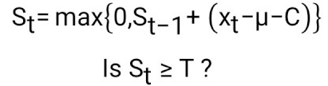

| **Question 4.1**
| **Answer:**
| 
| I am working at a management consulting firm for a client in home healthcare industry. I think clustering models can help our client classify their customers (patients) into different groups. Then our client can improve customer satisfaction by assigning appropriate caregivers to customers within same groups.
| 
| For example, if customer A is satisfied with the services provided by his / her caregiver, our client can assign the same caregiver to other customers who are in the same group (cluster) as customer A.
| 
| The predictors of the model could include: customers' age, gender, annual income; weekly service hours required, etc.

| 
| **Question 4.2**
| **Answer:**
| 
| First, read and scale the data.

```{r}
    rm(list = ls())
    set.seed(19)
    data <- read.table("C:\\Data\\week 2 data-summer\\data 4.2\\iris.txt", 
                       stringsAsFactors = FALSE, header = TRUE)
    #Scale the data set
    scale_data <- scale(data[1:4])
```

| Next, we will run k-means model. We will try different k values varying from 1 to 10, and choose the best k value using the "elbow" diagram.
| 
| For each k value, we will randomly select k rows from the data set as the centers of initial starting clusters. Since different initial clusters may lead to different clustering results, we sill set the parameter *nstart = 100*, so that the model will test 100 different sets of initial clusters and choose the set of initial clusters that generates smallest total within-cluster sum of squares.
| 

| We can apply this approach to all possible combinations of predictors (at least 2 predictors) and see if the best k value will change as we select different sets of predictors. We will use R function *combn()* to generate all possible combinations of column indices of predictors.
| 

```{r,fig.width=5, fig.height=3.5}
    set.seed(19)

    select_predictors <- function(pred_index){
      print("Predictors: ")
      print(colnames(scale_data)[pred_index])
      
      #Store the total within-cluster sum of squares for each k value in the following vector
      wcss <- c()
      #Test k from 1 to 10
      for (k in 1:10){
        model = kmeans(scale_data[,pred_index], centers = k, nstart = 100)
        wcss <- c(wcss, model$tot.withinss)
      }
      #Visualize the results
      plot(wcss, type="b", col="red", xlab="",
           mar=c(0,0,0,0),cex=0.5, cex.axis=0.8, cex.main=0.6)
      mtext("K", side = 1, line = 2)
    }
    #Show the results for all possible predictor combinations (at least 2 predictors)
    predictor_combo = combn(1:4, 2)
    for (i in 1:ncol(predictor_combo)){
      pre_index <- predictor_combo[,i]
      select_predictors(pre_index)
    }
    
    predictor_combo = combn(1:4, 3)
    for (i in 1:ncol(predictor_combo)){
      pre_index <- predictor_combo[,i]
      select_predictors(pre_index)
    }
    
    select_predictors(1:4)

```

| The "elbow" diagrams above shows how the total within-cluster sum of squares changes as k increases for different combinations of predictors. We can see that no matter which combination of predictors we select, k=3 can always be a reasonable number of clusters to choose. Therefore we will choose k=3 to perform the k-means model, which is in consistence with the data set's initial classification in the last column.

| The next step is to determine the best combination of predictors. Here we will plug in k=3 in to models with all possible predictor combinations (at least 2 predictors). We will compare the clustering results of our models with the "Species" column in the original data set. We will calculate the accuracy of the clustering by counting how many data points are correctly clustered out of 150.
| (Refer to "Purity" method at Wikipedia: <https://en.wikipedia.org/wiki/Cluster_analysis#External_evaluation>)

| We will print the comparison of the clustering results with original data in table format. The row index of the table will be the index of the clusters returned by k-means model. The column index of the table will be the Species categories in the initial data set. The values in the table will be the number of data points falling into each combination.

```{r}
    set.seed(19)
    
    accuracy <- function(pred_index){
      print("Predictors: ")
      print(colnames(scale_data)[pred_index])
      
      model = kmeans(scale_data[,pred_index], centers = 3, nstart = 100)
      
      #Print comparison between clustering results and original data
      pre_table <- table(model$cluster, data$Species)
      print(pre_table)
      
      #Measure clustering accuracy
      sum <- 0
      for (i in 1:ncol(pre_table)){
        sum <- sum + max(pre_table[, i])
      }
      print("Accuracy: ")
      print(sum/150)
      print("--------------------------------------------------------------------")

    }
    #print clustering results for all predictor combinations (at least 2 predictors)
    predictor_combo = combn(1:4, 2)
    for (i in 1:ncol(predictor_combo)){
      pre_index <- predictor_combo[,i]
      accuracy(pre_index)
    }
    
    predictor_combo = combn(1:4, 3)
    for (i in 1:ncol(predictor_combo)){
      pre_index <- predictor_combo[,i]
      accuracy(pre_index)
    }
    
    accuracy(1:4)
```

| From the results above, we can see that the accuracy of k-means model reaches the highest level of 96% when the predictors are "Petal.Length" and "Petal.Width" (k=3)
| Therefore, we will choose "Petal.Length" and "Petal.Width" as our best combination of predictors. And we can calculate the accuracy of the model as follows:
| 
| Accuracy = (50+48+46) / 150 = 96%

| 
| 
| **Question 5.1:**
| **Answer:**
| 
| First, load the library and read the data.

```{r}
    library(outliers)
    rm(list = ls())
    
    set.seed(19)
    data <- read.table("C:\\Data\\week 2 data-summer\\data 5.1\\uscrime.txt", 
                       stringsAsFactors = FALSE, header = TRUE)
    #Only the last column is needed
    test_data <- data$Crime

```

| Next we need to test if the data set follows a normal distribution, since normal distribution is an underlying assumption for *grubbs.test* function. Here we are going to apply *shapiro.test* and Normal Q-Q plot to see if the data follows normal distribution.
| 
| From the results below we can see that *shapiro.test funtion* generates a p value of 0.00188 which is smaller than 0.05. The data points on the Normal Q-Q plot are also generally located around the diagonal of the chart. Therefore we can conclude that the data set follows the pattern of normal distribution.

```{r}
    shapiro.test(test_data)
    qqnorm(test_data)
```

| 
| Then we are going to run *grubbs.test* function separately to test if any of the maximum and minimum values in the "Crime" column are outliers.

```{r}
    #Test if maximum value is outlier
    grubbs.test(test_data, type=10)
    #Test if minimum value is outlier
    grubbs.test(test_data, type=10, opposite=TRUE)
```

| In the test results above, neither p values are smaller than 0.05
| Therefore, we failed to reject the null hypothesis in both the tests. We don't have enough evidence to conclude that either the maximum value or the minimum value is outlier.

| 
| 
| **Question 6.1**
| **Answer:**
| 
| I am working at a management consulting firm. In a consulting firm, utilization % is a very important KPI that management team will use to manage human resources. It is calculated as follows: suppose a full time employee works 40 hours a week. The weekly utilization rate of this employee equals the hours he/she spends working on client work divided by 40. If the rate goes beyond 100%, it means the employee is working overtime on client project and may need help from others.
| 
| Project managers can use a CUSUM model to track if the utilization rate of their team significantly increases. If that happens, the manage may need to reach out to their supervisors and ask for more human resources for the project. Consider following formula of CUSUM model:

{width="168"}

| **Xt** stands for the weekly utilization rate of a project team.
| The normal average utilization rate in our firm is around 90%. Therefore we set **µ=90**.
| Any daily utilization rate smaller or equal to 100% should not trigger an alert. Therefore, **C=10**.
| Suppose a project manager wants to be alerted when the team's utilization rate is beyond 110% for two consecutive weeks. We can set **T = 20**.

| 
| 
| **Question 6.2**
| **Question 6.2.1**
| **Answer:**
| 
| First, read the data. We need to calculate the average summer temperature for each year. To make sure that what we are calculating is "summer" temperature, we are using data only in July for the calculation. The results will be stored in ***"avg_temp"***

```{r}
    rm(list = ls())
    
    set.seed(19)
    data <- read.table("C:\\Data\\week 2 data-summer\\data 6.2\\temps.txt", 
                       stringsAsFactors = FALSE, header = TRUE)
    #Calculate average summer temperature for each year
    avg_temp <- colMeans(as.matrix(data[1:31,-1]))
    data.frame(avg_temp)
```

To set up a CUSUM model to detect decrese in temperature, we need to define and calculate the following term for each year in the data set:

{width="195"}

| **St** is the cumulative term.
| Here we set **µ** to be the average summer temperature of each year; **C = 5**; **T = 30**
| We are going to store the series of **St** for each year in a new data frame called "cusum_df"
| We will find the the first day when the cumulative term **St** reaches the threshold **T** in each year. This date is when unofficial summer ends. The results will be stored in data frame "summer_end_df"

| Here's how we define **C** and **T**:
| First we assume that in summer season, it is normal that the temperature will fluctuate around the average temperature within 5 degrees. Therefore **C=5**.
| Then we will tweak the value of **T** and observe if the "summer end dates" returned by CUSUM model are reasonable. For example, if we set **T=0** (too low), then the dates returned by CUSUM model will always be July 1, which is absolutely not a reasonable date of summer end.
| After trying **T = 15, 20, 25, 30**... we choose **T= 30**. Here are the results:

```{r}
    cusum_df <- data.frame()
    #initialize cusum_df with the values of the temperature data set
    #Ignore "Date" column
    cusum_df <- data[,-1]
    
    #Define C and T
    C <- 5
    T <- 35
    
    #calculate the cumulative term, St, for all years
    #The data that already exist in cusum_df will be overwritten
      #initialize the first row
    for (j in 1:ncol(cusum_df)){
      cusum_df[1,j] <- max(0, avg_temp[j] - cusum_df[1,j] - C)
    }
    for (i in 2:nrow(cusum_df)){
      for (j in 1:ncol(cusum_df)){
        cusum_df[i,j] <- max(0, cusum_df[i-1,j] + avg_temp[j] - cusum_df[i,j] - C)
      }
    }
    #Display the results by visuling cusum_df table
    matplot(cusum_df, type = "l",pch=1,col = 2:20, xlab = "days")
    legend("topleft", legend = colnames(cusum_df[,-1]), col=2:20, pch=1, 
           inset=c(0,0), cex =0.72)
    
    #Find the dates when unofficial summer ends for each year
    years <- c()
    dates <- c()
    for (j in 1:ncol(cusum_df)){
      years<- append(years, colnames(cusum_df)[j])
      for (i in 1:nrow(cusum_df))
        if (cusum_df[i,j] >= T){
          dates <- append(dates, data$DAY[i])
          break
        }
    } 
    summer_end_df = data.frame("Year"=years, "Unofficial Summer End Date" = dates)
    print(summer_end_df)
```

| 
| **Question 6.2.2**
| **Answer:**
| 
| To measure whether Atlanta's summer climate has gotten warmer from 1996 to 2015, we are going to run CUSUM model on the yearly average summer temperature of Atlanta during this time period. The data has already been stored in ***"avg_temp"***
| Then we need to calculate the average summer temperature of Atlanta using the data across all years. The number will be stored in **"atl_avg_temp"**

```{r}
    atl_avg_temp <- mean(avg_temp)
    atl_avg_temp
```

| Next, we define the following equation and calculate **St** using each year's average summer temperature. The calculation results will be stored in ***"cusum_yearly"***

{width="210"}

| Here we set ***C=2***. Here's my thought:
| The fluctuation of yearly average temperature should be much smaller than daily temperature. In last question, we set C=5. In this question, we will set **C=2**, assuming that the yearly average summer temperature will fluctuate less than 2 degrees around the overall average temperature.

```{r}
    #initialize cusum_yearly and C value
    C <- 2
    cusum_yearly <- c()
    cusum_yearly[1] <- max(0, avg_temp[1] - atl_avg_temp - C)
    
    for (i in 2:length(avg_temp)){
      cusum_yearly[i] <- 
        max(0, cusum_yearly[i- 1] + avg_temp[i] - atl_avg_temp - C)
    }
    plot(cusum_yearly, type = 'o')
    axis(1, at=1:20,labels=1996:2015)
    data.frame('years' = 1996:2015, 'cusum' = cusum_yearly)
    
```

| In the chart above, **St** reaches the maximum value of 5.04 in year 2012. Therefore, any value of **T** less or equal to 5.04 will lead to the conclusion that Atlanta's summer climate has gotten warmer from 1996 to 2015. Since **St** increases significantly from 2009 to 2012, we would like to set **T=4** (can't be too small, but should be less than 5.04) and draw a conclusion that Atlanta's climate has gotten warmer in this period.
