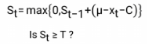
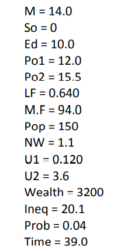

| **Question 7.1**
| **Answer:**
| 
| The exponential smoothing model could be used to predict stock prices in near future. To run this model, we need the data of historic daily closing prices for the stocks we want to predict.
| Since there's a lot of randomness in stock price fluctuation (some scholars even believe that stock prices follow a "Random Walk" pattern), we would expect the alpha value closer to 0.

| 
| 
| **Question 7.2**
| **Answer:**
| First, read the data and convert the temperature data (column 2 to 21) into a vector. Then, we will use ts() function to convert the vector into a time series object which will be used as our time series data. The time series data will be displayed in a plot.

```{r}
    #read file
    rm(list = ls())
    set.seed(19)
    data <- read.table("C:\\Data\\week 3 data-summer\\data 7.2\\temps.txt", 
                       stringsAsFactors = FALSE, header = TRUE)
    #Convert the temperature data into a time series object
    temp_vec <- as.vector(unlist(data[2:21]))
    temp_ts <- ts(temp_vec, start = 1996, frequency = 123)
    
    #Display the teime series
    plot.ts(temp_ts)
```

| Then we are going to run ***HoltWinters()*** function on the time series we just created. We will define alpha, beta and gamma to be null so that the model will estimate the best parameters for us. We will also set "seasonal" to be multiplicative.
| The comparison of our models estimations and the real temperature data will be displayed in a plot. The black line represents the actual temperature data while the red line represents the estimation of our model.

```{r}
    temp_es <- HoltWinters(temp_ts, alpha = NULL, beta = NULL, gamma = NULL,
                          seasonal = "multiplicative")
    plot(temp_es)
    summary(temp_es)
    
    head(temp_es$fitted)
```

| To determine whether the unofficial end of summer has gotten later over the 20 years, we are going to take the following approach:
| First, we are going to load the seasonal factors returned by ***HoltWinters()*** function into a data frame with similar structure as the raw data (dates in rows, and years in columns). Let's display the trends of each year's seasonal factor in line chart:

```{r}
    #Convert seasonal factors into matrix
    season_df <- as.data.frame(matrix(temp_es$fitted[,4], nrow = 123))
    season_df <- cbind(data[,1],season_df)
    colnames(season_df)[1] <- "Dates"
    colnames(season_df)[2:ncol(season_df)] = colnames(data[3:21])
    
    matplot(season_df, type = "l",pch=1, col = 2:20, xlab = "days")
    legend("top", legend = colnames(season_df[,-1]), col=2:20, xpd = TRUE, pch=1,
           inset=c(0,-0.13), cex =0.6, bty = "n",  ncol=10)
```

| Then we are going to run a CUSUM model to find the date when the seasonal factor significantly decreases for each year. The dates we find will be the unofficial end of summer. Then we are going to observe if the date is getting later across the time periods.
| Since we are going to detect significant decrease, consider following equation for CUSUM model:
| 



| To make sure that **µ** represents the average seasonal factors in summer. We will define **µ** as each year's average seasonal factor in July only.
| Since seasonal factor is a coefficient returned by exponential smoothing model instead of a real temperature. It's not easy to define the value of **C** and **T** using common sense. Therefore we are going to use the standard deviation of each years' seasonal factors (July only) as a benchmark.
| For each year, we define **C** equals the 2 times that year's standard deviation seasonal factor (July only), and **T** equals 6 times that year's standard deviation of seasonal factor (July only).
| 
| **Note:**
| I tried several difference set of numbers to determine how many times of standard deviation C and T should be. If the numbers of times are too big or too small, the unofficial summer end dates returned by CUSUM will be too early or too late. I choose 2 and 6 in the end since this combination returns my some "reasonable" dates of summer end.

```{r}
    #initialize cusum_df with the values of the seasonal factor data set
    cusum_df <- season_df
    year_vec <- c()
    summer_end_vec <- c()
    
    for (j in 2:ncol(season_df)){
      
      #Define mu, C and T
      mu <- mean(unlist(season_df[1:31,j]))
      C <- 2*sd(unlist(season_df[1:31,j]))
      T <- 6 * sd(unlist(season_df[1:31,j]))

      #initialize the first row
      cusum_df[1,j] <- max(0, mu - cusum_df[1,j] - C)
      
      #Calculate St for each date
      for (i in 2:nrow(season_df)){
        cusum_df[i,j] <- max(0, cusum_df[i-1,j] + mu - cusum_df[i,j] - C)
      }
    }
    
    # find summer end date for each year
    for (j in 2:ncol(season_df)){
      year <- colnames(season_df)[j]
      for (i in 2:nrow(season_df)){
        if (cusum_df[i,j] >= T){
          year_vec <- append(year_vec, year)
          summer_end_vec <- append(summer_end_vec, season_df[i,1])
          break
        }
      }
    }
    
    summer_end_df <- data.frame("Year" = year_vec, 
                                "Summer End Date" = summer_end_vec)
    #show the unofficial summer end date for each year
    print(summer_end_df)
    
```

| From the table above, we can see that the unofficial summer end date didn't significant change from 1997 to 2015. Therefore, the unofficial end of summer hasn't gotten later over the timer period.

| 
| 
| **Question 8.1**
| **Answer:**
| 
| I am a basketball fan and played campus basketball when I was at school. An important factor that middle school basketball coaches would consider when they select their players is how tall the young players would be in the near future. Let's assume we are selecting some young basketball players who are 12 years old, and we want to know how tall they would be when they are 15. In this scenario, we can use linear regression model to make the prediction.
| The predictors may include: the student's height at the age of 12, the heights of the student's parents, student's gender, number of hours the student sleeps everyday (assuming more sleep helps teenagers grow taller), etc.

| **Question 8.2**
| **Answer:**
| 
| First, read the data and display the first few rows.

```{r}
    #read file
    rm(list = ls())
    set.seed(19)
    data <- read.table("C:\\Data\\week 3 data-summer\\data 8.2\\uscrime.txt", 
                       stringsAsFactors = FALSE, header = TRUE)
    
    head(data)
```

Next, we are going to run a linear regression model using "Crime" as results and all the other 15 variables as predictors.

```{r}
    model <- lm(Crime~M+So+Ed+Po1+Po2+LF+M.F+Pop+NW+U1+U2+Wealth+Ineq+Prob+Time,
                data = data)
    summary(model)
```

| As we can see from the results above, there are a few coefficient that have p values larger the threshold of 0.1. This means that these coefficient are not significant and may cause overfitting issue. We may need to exclude them from the model. Here's the model after these coefficients are excluded:

```{r}
    model2 <- lm(Crime~M+Ed+Po1+U2+Ineq+Prob,
                data = data)
    summary(model2)
```

| In the second model, we excluded all the insignificant coefficient and kept only six predictors. We can find from their p values that all these predictors have significant coefficients. Therefore we are going to use this model to make predictions.

| We are going to use the adjusted R squared value of this model as an estimate of the quality of fit, which equals 0.7307.
| 
| If we plug in the predictors provided in the questions:

{width="162"}

| We can make following prediction:
| Crime = -5040.5 + 105.02 \* 14 + 196.47 \* 10 + 115.02 \* 12 + 89.37 \* 3.6 + 67.65 \* 20.1 - 3801.84 \* 0.04
|            = 1304.245

```{r}
    input <- data.frame("M" = 14.0,
                         "Ed" = 10.0,
                         "Po1" = 12.0,
                         "U2" = 3.6,
                         "Ineq" = 20.1,
                         "Prob" = 0.04)
    prediction <- predict(model2, newdata = input)
    prediction

```

| 
| 
