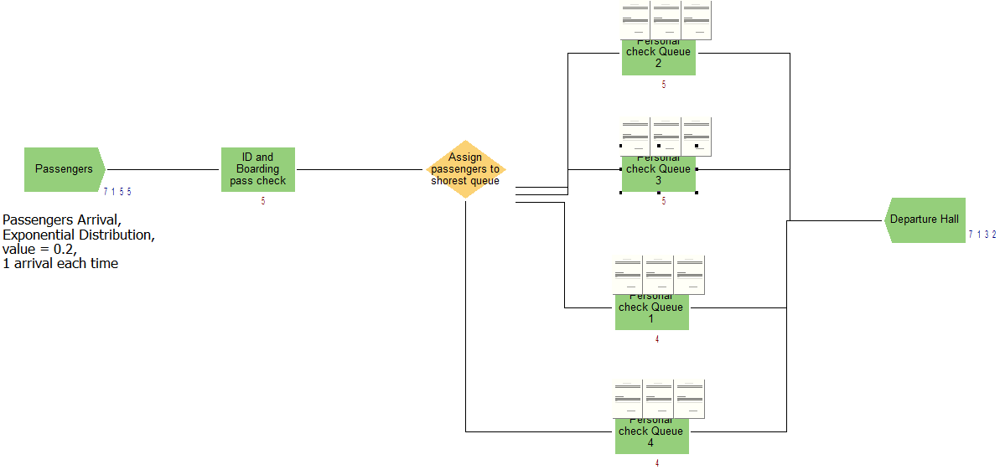
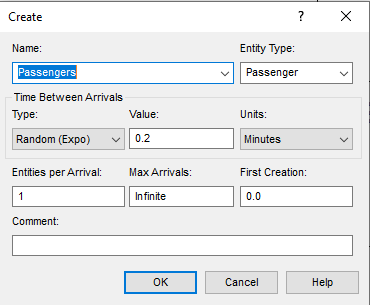
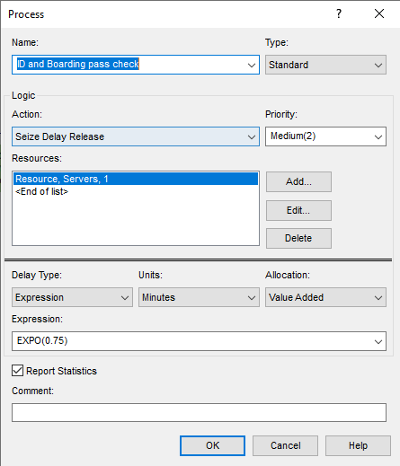
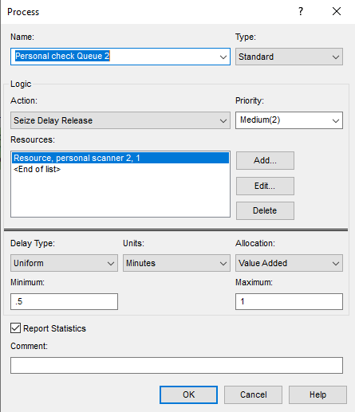
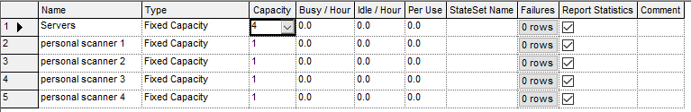
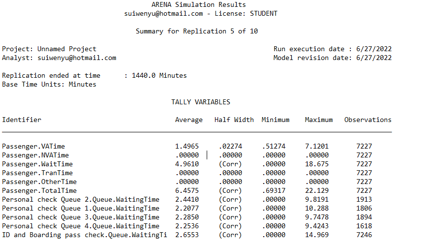

| 
| 
| **Question 13.2**
| **Answers:**
| 
| The following screenshot shows the flowchart we set up in Arena. The settings of some key blocks are also displayed in separate screenshots:
| 
| The flow chart:
| 



| 
| Settings of "passenger" block:
| 



| 
| Settings of "ID and Boarding Pass Check" block:
| 



| 
| Settings of "Personal Check Queue" block (using one out of four as example):
| 



| 
| To change the number of personal check queues. We need to add more branches to the flowchart and change the conditions in the n-way decision activity (Assign passengers to shorest queue), so that we make sure the passengers always go to the shortest queue.
| To change the number of servers at "ID and boarding pass check", we simply need to change the capacity of "Servers" in the resources table:
| 



| 
| After trying different numbers of servers and personal check queues, we finally decide to keep 4 servers and 4 personal check queues in the flowchart, because this setting:
| 
| 1. Avoids the error of exceeding 150 maximum passengers waiting in queues
| 2. Keeps the average waiting time below 15 minutes
| 

| 
| Note: In this simulation, we let the software to run 10 replications. Each replication will last 24 hours to make sure the results are not biased. Here's one of the 10 replication that has the longest average waiting time:
| 
| 

| 



| 
| 
| **Question 14.1**
| **Question 14.1.1**
| **Answer:**
| 
| In this part, we will use mean/mode to impute missing values. First read the data.
| From the summary info we can see that only column V7 has 16 missing values. (about 2.29% of total number of rows)

```{r}
    rm(list = ls())
    set.seed(19)
    data <- read.table("C:\\Data\\week 6 data-summer\\data 14.1\\breast-cancer-wisconsin.data.txt", 
                       stringsAsFactors = FALSE, header = FALSE, sep = ",",
                       na.strings = "?")
    summary(data)
    
    #Display all rows with missing values
    missing_rows <- is.na(data$V7)
    data[missing_rows,]
```

| Then we are going to impute the missing values with mean and mode. We are going to use mfv() function in "modeest" package to find the mode. Here's the approach:

```{r}
    library(modeest)
```

```{r}
    # Copy the data
    data_impute_mean <- data
    #impute missing values with mean
    data_impute_mean$V7[missing_rows] <- mean(data$V7, na.rm = TRUE)  
    
    #Display all rows with missing values in original data 
    #(filled with mean value)
    data_impute_mean[missing_rows,]
    
    # Copy the data
    data_impute_mode <- data
    #impute missing values with mode
    mode <- mfv(data$V7)
    data_impute_mode$V7[missing_rows] <- mode

    #Display all rows with missing values in original data 
    #(filled with mode value)
    data_impute_mode[missing_rows,]
```

| 
| **Question 14.1.2**
| **Answer:**
| 
| In this part, we are going to impute the missing values with regressions.
| One simple way is to use mice() function in "mice" packages, which contains built-in imputation functionalities. Hereare the documentations of this function and some tutorials that i have referred to :
| 
| <https://www.rdocumentation.org/packages/mice/versions/3.14.0/topics/mice>
| <https://www.analyticsvidhya.com/blog/2016/03/tutorial-powerful-packages-imputing-missing-values/>
| <https://rpubs.com/McCloud77/300268>
| 
| To run an imputation with linear regression, we simply need to set the "method" parameter in mice() function to be "norm.predict". Here's the approach:

```{r}
    library(mice)
```

```{r}
    impute_reg <- mice(data, method = "norm.predict")
    data_impute_reg <- complete(impute_reg)
    
    #Display all rows with missing values in original data 
    #(filled with predictions from linear regression)
    data_impute_reg[missing_rows,]
```

| 
| 
| **Question 14.1.3**
| **Answer:**
| 
| To run an imputation using linear regression with perturbations, we simply need to set the "method" parameter in mice() function to be "norm.nob". Here's the approach:

```{r}
    set.seed(100)
    
    impute_reg_per <- mice(data, method = "norm.nob")
    data_impute_reg_per <- complete(impute_reg_per)
    
    #Display all rows with missing values in original data 
    #(filled with predictions from linear regression with perturbations)
    data_impute_reg_per[missing_rows,]
```

| 
| **Question 15.1**
| **Answer:**
| 
| A plant that produces multiple types of products can use optimization to determine the quantity of each type of products to be produced each year. The best production plan should maximize the gross margin ratio of the plant. Here are some data that may be needed:
| 
| 1. Sales price and production cost for each type of product
| 2. The quantity of raw materials and labor that each type of product will consume in production
|     (may be needed for setting constraints)
| 3. Maximum quantity of each product that the plant is able to produce each year
